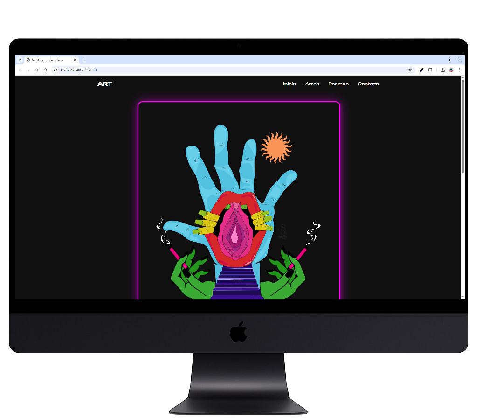
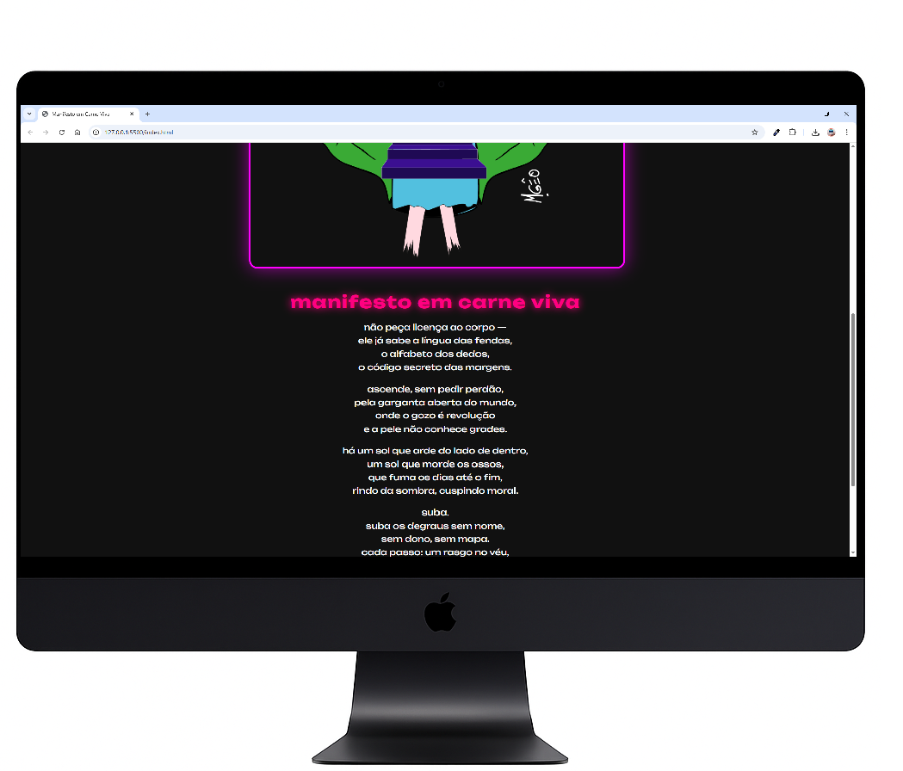

# 🎨 Interface para "Manifesto em Carne Viva"

Este projeto é uma página web desenvolvida para exibir a arte e o poema **"Manifesto em Carne Viva"**, criados por uma ilustradora parceira.
Minha contribuição foi criar a **interface visual do site** utilizando HTML e CSS, com foco em destacar a estética da ilustração e a força da poesia.

---

## 🖌️ Sobre o projeto

- O site apresenta uma obra visual intensa e um poema impactante.
- Utilizei HTML e CSS puros para montar a estrutura e o estilo da página.
- A composição visual e o contraste de cores foram feitos com o cuidado de respeitar a identidade da arte original.

---

## 💻 Tecnologias utilizadas

- HTML  
- CSS  

---

## 📸 Preview

  
  

---

## Você pode visualizar meu site em:

https://adriciachiarini.github.io/Pag-MGEO-ART/
